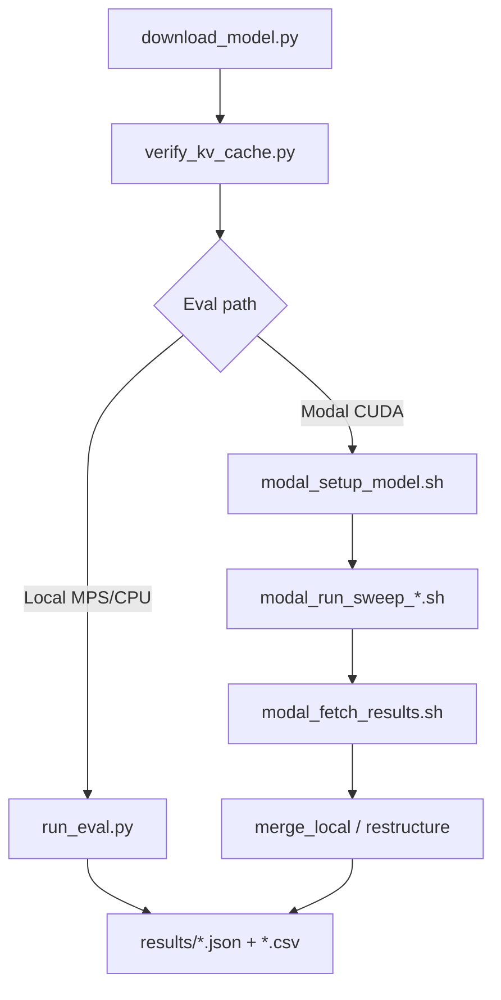

# KV-Cache Compression Benchmark: A Fixed Eval Stack for TurboQuant, QJL, and RocketKV

A pluggable **KV-cache interception + transformation engine** on **Qwen3-1.7B**, with one shared evaluation pipeline — no per-paper forks, no metric drift.

## Overview

This repository provides:

- **`framework/kv_engine.py`** — Intercept `past_key_values` between autoregressive steps
- **`compressors/*`** — Plug-in `KVCompressor` implementations (TurboQuant, QJL, RocketKV, identity)
- **`eval/` + `reporting/`** — Fixed Section A (offline fidelity) and Section B (online PPL + throughput) metrics
- **`modal_app/`** — Parallel CUDA sweeps on Modal A10G (`spawn_map`, one GPU per job)
- **`scripts/run_eval.py`** — Local dev/smoke eval (Apple Silicon MPS or CPU)

The evaluation pipeline:

1. Load Qwen3-1.7B with eager attention (required for KV access)
2. Build long-context WikiText-2 sequences (128 / 256 / 512 tokens)
3. Run Section A: offline compress → fidelity + memory accounting
4. Run Section B: incremental compressed KV in the generation loop → perplexity + tok/s
5. Export JSON/CSV; merge Modal job outputs into sweep bundles

**Research question:** *Under identical model, data, and metrics, which KV compression method best trades memory for quality and speed?*

```text
Tokenizer → Model Forward → KV Cache → (intercept) → KVCompressor → Attention → Next tokens
                                              │
                         TurboQuant | QJL | RocketKV | identity
```

| Component | Role | Changes per paper? |
|---|---|---|
| `framework/kv_engine.py` | Intercepts `past_key_values` between steps | No |
| `compressors/*` | Transform K/V tensors | **Yes** |
| `eval/` + `reporting/` | Memory, speed, perplexity | No |

Full architecture: [docs/SYSTEM_DESIGN.md](docs/SYSTEM_DESIGN.md)

## Main results

**Setup:** Qwen3-1.7B · WikiText-2 test · ctx 128 / 256 / 512 · Modal A10G · Phase 5 sweeps complete (27 jobs + shared baseline)

### Cross-method summary @ ctx=512

| Method | Config | PPL | vs baseline | Memory savings | tok/s |
|---|---|---:|---:|---:|---:|
| Identity | — | 14.11 | 1.0× | 1.0× | 13.85 |
| TurboQuant | `tq_full_b4` | 18.6 | **1.3×** | **3.1×** | 0.08 |
| QJL | `qjl_default` | 532,967 | ~37,800× | 1.9× | 0.35 |
| RocketKV | `rocketkv_r75` | 11,829,014 | ~838,000× | 1.3× | 9.22 |

### TurboQuant 4-bit @ ctx=512 (best quality–compression tradeoff)

| Metric | Value |
|---|---:|
| Perplexity (compressed / baseline) | 18.6 / 14.11 |
| Compression ratio | 3.12× |
| Effective bits/KV | 5.13 |
| Key RMSE | 0.36 |
| Throughput | 0.08 tok/s (baseline: 13.85) |

### Shared identity baseline

| ctx | PPL | tok/s |
|---:|---:|---:|
| 128 | 14.21 | 23.68 |
| 256 | 17.66 | 17.68 |
| 512 | 14.11 | 13.85 |

**Takeaway:** Only **TurboQuant 4-bit at ctx≥256** stays near baseline perplexity (~1.3×) with ~3× memory savings. QJL and RocketKV show large online quality loss under current online paths despite moderate memory reduction. TurboQuant online inference is very slow on this stack (~0.08 tok/s vs ~14 baseline).

Full tables, anomalies, and interpretation: [docs/PHASE5_EVAL_RESULTS.md](docs/PHASE5_EVAL_RESULTS.md)

## Prerequisites

- Python 3.11
- macOS (Apple Silicon MPS) or Linux/CPU for local dev
- Hugging Face account + token ([model access](https://huggingface.co/Qwen/Qwen3-1.7B))
- ~6 GB disk (venv + model + dataset cache)
- **Modal account** (recommended for full CUDA sweeps; no local GPU required for Phase 5 grid)

> **Apple Silicon:** `fast-hadamard-transform` requires CUDA and does not build on MPS. Core eval works without it; Modal uses scipy WHT fallback.

## Quick Start

### 1. Clone repository

```bash
git clone https://github.com/faheemgurkani/kv-cache-compression-benchmark.git
cd kv-cache-compression-benchmark
```

### 2. Create Python environment

```bash
python3.11 -m venv .venv
source .venv/bin/activate
pip install --upgrade pip
pip install torch torchvision torchaudio
pip install -r requirements.txt
```

If `fast-hadamard-transform` fails on Mac, install without it — identity baseline and the eval framework still work.

### 3. Configure Hugging Face

```bash
cp .env.example .env
# Edit .env: HF_TOKEN=hf_xxxxxxxxxxxxxxxx
```

### 4. Download model

```bash
python scripts/download_model.py
```

Saves `Qwen/Qwen3-1.7B` to `models/qwen3_1.7b/` (~3.2 GB).

### 5. Verify KV-cache access

```bash
python scripts/verify_kv_cache.py
pytest tests/ -q
```

### 6. Run a local smoke eval

```bash
python scripts/run_eval.py --compressor identity --context-length 512
```

Results land in `results/` (gitignored).

## Usage

### Local evaluation

```bash
# Identity baseline
python scripts/run_eval.py --compressor identity --context-length 512

# TurboQuant full pipeline
python scripts/run_eval.py --compressor turboquant --stage full --context-length 512

# QJL / RocketKV
python scripts/run_eval.py --compressor qjl --context-length 512
python scripts/run_eval.py --compressor rocketkv --context-length 512

# Context-length sweep (128, 256, 512)
python scripts/run_eval.py --compressor identity --all-context-lengths
```

### Modal GPU sweeps (recommended for full grid)

```bash
pip install modal

# One-time: cache model on Modal Volume (~3.2 GB)
bash scripts/modal_setup_model.sh

# Shared baseline (3 jobs) — run once
bash scripts/modal_run_sweep_baseline.sh

# Method sweeps (detached)
bash scripts/modal_run_sweep.sh              # turboquant (12 jobs)
bash scripts/modal_run_sweep_qjl.sh          # qjl (3 jobs)
bash scripts/modal_run_sweep_rocketkv.sh     # rocketkv (9 jobs)

# Single-job smoke @ ctx=128
bash scripts/modal_smoke_eval.sh qjl

# Fetch + merge
bash scripts/modal_fetch_results.sh
modal run modal_app/sweep.py::merge_local \
  --input-dir results/modal_volume/qjl --output phase5_modal_qjl \
  --label-prefixes qjl_default
```

Runtime: ~15–90 min per preset on parallel A10G workers (longest single job dominates).

Full runbook: [docs/MODAL_GPU_EVAL_DESIGN.md](docs/MODAL_GPU_EVAL_DESIGN.md)

### TurboQuant validation

```bash
python scripts/validate_turboquant.py --phase intercept
python scripts/validate_turboquant.py --phase stages
```

## Configuration

Settings live in `configs/`.

### `configs/model.yaml`

| Key | Default | Effect |
|---|---|---|
| `model_name` | `Qwen/Qwen3-1.7B` | Hugging Face model ID |
| `local_path` | `models/qwen3_1.7b` | Local weight directory |
| `context_lengths` | `128, 256, 512` | Eval sweep lengths |
| `bitwidths` | `2, 3, 4` | TurboQuant target bitwidths |

### `configs/eval.yaml`

| Key | Default | Effect |
|---|---|---|
| `wikitext.split` | `test` | Eval split |
| `perplexity_stride` | `512` | Sliding-window stride |
| `generated_tokens` | `64` | Throughput test length |
| `default_context_length` | `512` | Default `--context-length` |

### `configs/modal_sweeps.yaml` — sweep presets

| Preset | Configs | Jobs (× ctx 128, 256, 512) |
|---|---|---|
| `baseline` | `identity_baseline` | 3 |
| `turboquant` | `tq_full_b2`, `tq_full_b3`, `tq_full_b4`, `tq_mse_b4` | 12 |
| `qjl` | `qjl_default` | 3 |
| `rocketkv` | `rocketkv_r25`, `rocketkv_r50`, `rocketkv_r75` | 9 |

Modal GPU/volume settings: `configs/modal.yaml`

## Dataset

**WikiText-2** — `Salesforce/wikitext`, config `wikitext-2-raw-v1`, test split.

| Property | Value |
|---|---|
| Usage | Long-context eval via concatenated samples |
| Context lengths | 128, 256, 512 (Phase 5); up to 32K supported locally |
| Cache | `.cache/huggingface/datasets/` (auto, gitignored) |

```python
from data.loader import load_wikitext2, build_long_context_ids

dataset = load_wikitext2()
token_ids = build_long_context_ids(tokenizer, dataset, target_length=512)
```

## Compressors

| Name | Status | Approach |
|---|---|---|
| `identity` | ✅ | Uncompressed baseline |
| `turboquant` | ✅ | WHT → Lloyd-Max → optional QJL residual |
| `qjl` | ✅ | 1-bit key signs via random projection |
| `rocketkv` | ✅ | Token eviction (SnapKV + HSA online) |
| `kivi` | 🔜 stub | Not implemented |

Readiness snapshot and known limits: [docs/CURRENT_STATE.md](docs/CURRENT_STATE.md)

## Key files

| File | Purpose |
|---|---|
| `scripts/run_eval.py` | Local full eval (Section A + B) |
| `scripts/run_baseline.py` | Single-baseline eval with JSON output |
| `scripts/download_model.py` | Download Qwen3-1.7B |
| `scripts/verify_kv_cache.py` | Confirm `past_key_values` access |
| `scripts/validate_turboquant.py` | TurboQuant stage ablation |
| `scripts/modal_run_sweep_baseline.sh` | Shared identity baseline (Modal) |
| `scripts/modal_run_sweep.sh` | TurboQuant preset sweep |
| `scripts/modal_run_sweep_qjl.sh` | QJL preset sweep |
| `scripts/modal_run_sweep_rocketkv.sh` | RocketKV preset sweep |
| `scripts/modal_smoke_eval.sh` | One-job Modal smoke @ ctx=128 |
| `scripts/modal_fetch_results.sh` | Pull job JSON from Modal volume |
| `scripts/restructure_modal_results.py` | Split baseline vs method bundles |
| `modal_app/sweep.py` | Parallel sweep orchestrator + merge |
| `modal_app/worker.py` | CUDA eval worker |
| `framework/kv_engine.py` | KV interception engine |
| `framework/rocketkv_online.py` | RocketKV online attention patch |
| `configs/modal_sweeps.yaml` | Sweep preset definitions |



## Outputs

| Artifact | Path | Tracked in git? |
|---|---|---|
| Local eval JSON/CSV | `results/*.json`, `results/*.csv` | No |
| Modal baseline bundle | `results/phase5_modal_baseline/` | No |
| TurboQuant sweep | `results/phase5_modal_sweep_128_256_512/` | No |
| QJL sweep | `results/phase5_modal_qjl/` | No |
| RocketKV sweep | `results/phase5_modal_rocketkv/` | No |
| Version-controlled summary | [docs/PHASE5_EVAL_RESULTS.md](docs/PHASE5_EVAL_RESULTS.md) | **Yes** |

## Documentation

| Document | Description |
|---|---|
| [docs/SYSTEM_DESIGN.md](docs/SYSTEM_DESIGN.md) | Architecture, plug-in model, compressor design |
| [docs/MODAL_GPU_EVAL_DESIGN.md](docs/MODAL_GPU_EVAL_DESIGN.md) | Modal GPU runtime, parallelism, runbook |
| [docs/PHASE5_EVAL_RESULTS.md](docs/PHASE5_EVAL_RESULTS.md) | Phase 5 sweep results and findings |
| [docs/CURRENT_STATE.md](docs/CURRENT_STATE.md) | Compressor readiness, setup snapshot |

## Troubleshooting

| Issue | Fix |
|---|---|
| `ModuleNotFoundError: compressors` | Run scripts from repo root |
| `Model not found at models/qwen3_1.7b` | `python scripts/download_model.py` |
| WikiText load fails | Use `Salesforce/wikitext` (set in `configs/eval.yaml`) |
| `fast-hadamard-transform` build error | Expected on Mac; skip or use Modal for TurboQuant CUDA |
| Slow eval at long context | Start with `--context-length 512`; `--skip-perplexity` for speed-only |
| MPS OOM | Reduce `--context-length` or use CPU |
| Full sweep too slow locally | Use Modal preset scripts (see Usage) |
| RocketKV baseline PPL corrupted | Fixed: baseline runs before attention patch (`eval/runner.py`) |

## Resources

**Model**

- Qwen3-1.7B: https://huggingface.co/Qwen/Qwen3-1.7B

**Compression methods (upstream papers)**

- TurboQuant — see paper referenced in [docs/SYSTEM_DESIGN.md](docs/SYSTEM_DESIGN.md)
- QJL — random projection key compression
- RocketKV — hybrid sparse attention / token eviction

**Infrastructure**

- Modal docs: https://modal.com/docs
- Hugging Face Transformers: https://huggingface.co/docs/transformers

## License

`kv-cache-compression-benchmark` is **MIT** licensed, as found in the [LICENSE](LICENSE) file (Copyright © 2026 Muhammad Faheem).

This project follows the licensing of underlying components:

- **Qwen3-1.7B:** Apache 2.0 — see [Hugging Face model card](https://huggingface.co/Qwen/Qwen3-1.7B)
- **WikiText-2:** Dataset terms — see [Salesforce/wikitext](https://huggingface.co/datasets/Salesforce/wikitext)
- **TurboQuant, QJL, RocketKV:** Respect respective paper and upstream code licenses when extending those implementations
